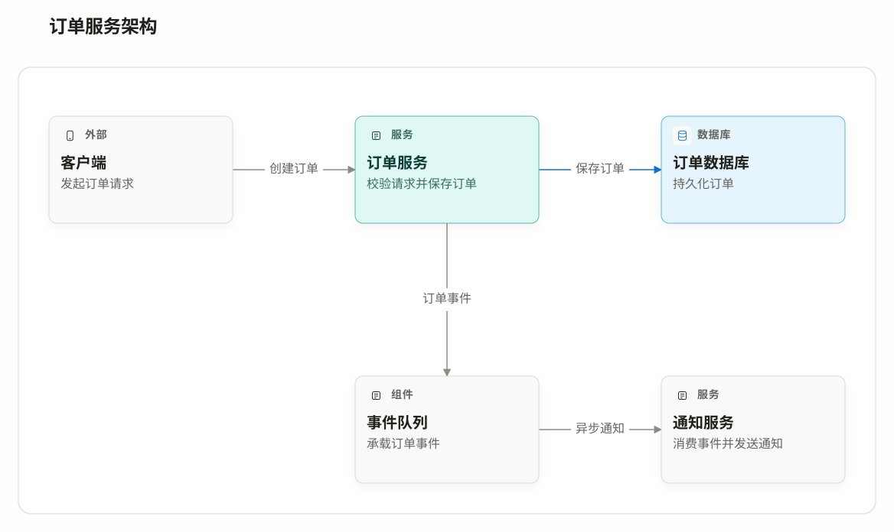

# QGraphFlow

Evidence-grounded interactive software diagrams, delivered as offline HTML.

从源码、数据库结构、配置或需求生成有证据可追溯的交互式软件图。输出为离线 `index.html` 和可编辑的 `graph.json`，页面支持 SVG / PNG 下载。

当前版本：**0.0.1** · [MIT 许可证](LICENSE) · [安装说明](docs/clients.md) · [下载](https://github.com/supermax92/qgraphflow/releases)



图中是虚构订单系统，仅用于演示。页面中可以搜索、查看节点详情、切换深浅主题、播放编排路径、调整布局和导出完整图。

## 先运行一个示例

准备 Node.js 22，从 [Release](https://github.com/supermax92/qgraphflow/releases) 下载 `qgraphflow-0.0.1.zip` 并解压，在解压后的插件根目录运行：

```bash
node skills/q-flow/scripts/validate-graph.mjs examples/order-flow.graph.json
node skills/q-flow/scripts/generate-viewer.mjs examples/order-flow.graph.json output/order-flow
```

用浏览器打开 `output/order-flow/index.html`，即可查看交互图；同目录的 `graph.json` 保留完整数据。修改输入 JSON 后重新生成即可更新图。再次运行时请选择新输出目录，避免覆盖已有结果。

普通生成使用随包提供的 Viewer，无需 `npm install`、模型 API Key 或启动后端服务。让 AI 从项目中取证并编写图数据，需要使用下述客户端自己的模型服务。

## 让 AI 为你的项目绘图

在支持的客户端中安装插件后，选择 `q-flow` 技能并描述目标，例如：

> 分析当前模块的入口、核心组件与调用关系，生成交互式架构图；保留源码文件和行号证据，并标明无法确认的关系。

支持九类图：**架构、流程、时序、ER、部署、类、状态、用例和数据流**。

所有客户端共用 `skills/q-flow/` 中的一份 Skill、生成器和预构建 Viewer。Codex 使用 `$q-flow`，Claude Code 使用 `/qgraphflow:q-flow`；Qoder 和 Cursor 按客户端技能入口选择。[安装、更新、卸载及验收状态](docs/clients.md)分别列出。

CodeGraph 是可选取证工具，未配置时直接读取源码。默认产物写入目标项目的 `docs/qgraphflow/<scope>-<diagram-type>/`，也可以指定其他目录。

## 使用边界

- 图的准确性取决于输入证据；区分源码、文档、框架约定和推断，关键关系需要人工复核。
- 播放只演示显式编排的路径或节点阅读顺序；它不采集程序真实执行轨迹。
- Viewer 内的布局调整会用于 SVG/PNG 导出；同目录的 `graph.json` 不会自动保存这些临时调整。
- 已提供四类客户端清单；原生客户端的发现、模型调用和完整绘图验收状态见安装说明。

## 本地开发

```bash
git clone https://github.com/supermax92/qgraphflow.git
cd qgraphflow
npm ci --prefix skills/q-flow/assets/viewer
npm run build --prefix skills/q-flow/assets/viewer
node --test tests/*.test.mjs skills/q-flow/scripts/*.test.mjs
```

开发测试需要 Node.js 22、npm、tar、zip 和 unzip。CI 在 Linux 上执行安装、构建、测试、示例生成和包检查；浏览器交互验证使用[开发说明](skills/q-flow/references/viewer-development.md)中的独立流程。

图数据格式见 [graph-schema.md](skills/q-flow/references/graph-schema.md)。反馈问题时请附最小脱敏 `graph.json`、客户端/浏览器版本和复现步骤；欢迎通过 [Issues](https://github.com/supermax92/qgraphflow/issues) 或 Pull Request 参与。

## 许可证与商标

项目采用 [MIT 许可证](LICENSE)，第三方组件及其条款见 [THIRD_PARTY_NOTICES.md](THIRD_PARTY_NOTICES.md)。

QGraphFlow 是独立开源项目，与文中提及的 Codex、Claude Code、Qoder、Cursor、CodeGraph 及其权利人无隶属、赞助或背书关系。相关产品名称和商标归各自权利人所有，仅用于说明兼容入口和可选集成。
